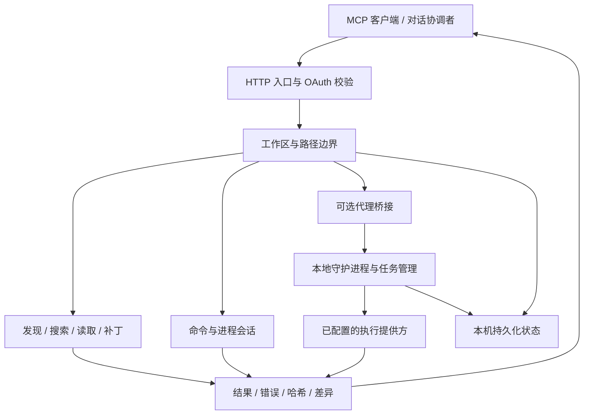

# DevSpace Personal

**让对话中的开发意图，成为本机可检查、可验证的操作。**

DevSpace Personal 是个人维护的 MCP 本地开发服务。它将项目发现、文件读取、
受保护修改、命令执行和代理任务协调组织为明确的工具接口，让支持 MCP 的
客户端在授权范围内使用本地开发环境。

它负责连接、执行和返回证据，不替用户决定权限，也不是无人值守的聊天机器人。

## 核心能力

### 项目发现与上下文读取

- 以工作区为操作单位，复用明确的 `workspaceId`。
- 分页列出项目文件，返回完成状态、游标和排除项。
- 提供字面量搜索，以及带 SHA-256 的 UTF-8 分页读取。
- 加载项目说明和已声明的技能，报告未完成的上下文扫描。

“读取项目”意味着按范围逐页获取内容，不是把整个仓库自动上传或一次塞入模型。

### 可预览、可核对的修改

补丁支持 `dryRun` 预览和 `expectedHashes` 内容校验。调用方先确认影响范围，
再针对刚读过的版本修改；内容变化时应重新读取，而不是移除校验强行覆盖。

文本修改保留可支持的 BOM 和换行形式。哈希保护不是多文件原子事务，失败后
仍需检查哪些文件已经落盘。

### 命令与验证

命令工具可运行测试、构建和项目脚本。短任务直接返回结果，长任务返回进程
会话标识，调用方继续获取输出、退出码及截断状态。

命令以服务账户的权限执行。工作区路径校验不会将任意 Shell 命令变成沙箱。

### 显式代理任务

可选 Codex 桥接提供预检、新建任务、续接、状态查询和任务恢复入口。请求键
用于处理重试与不确定交付，任务标识用于保持上下文；接受请求不等于任务完成。

启用执行策略后，每轮要求显式模型，并校验客户端版本、权限回执和对应轮次的
运行证据。普通文件工具不启动模型推理。

### 状态与可观测性

工作区、授权和代理任务的必要状态保存在本机；运行进程按生命周期管理。
工具结果包含可供下一步判断的信息，日志用于定位失败层，差异汇总用于审查改动。

## 工作原理



- **直接操作路径：** 客户端调用文件或命令工具，DevSpace 执行并返回结果。
- **代理委派路径：** 客户端明确提交任务，守护进程调用已配置提供方，再返回状态。

两条路径共享工作区约束，但不能把文件读取说成模型编程，也不能把模型的
口头回复说成真实文件修改。

## 核心设计

- **客户端协调，服务执行。** 不在服务端隐藏无限对话循环。
- **身份明确。** 工作区、逻辑任务、提供方会话和命令进程分别使用自己的标识。
- **权限分层。** 文件边界、代理沙箱和操作系统账户权限分别校验。
- **结果可验证。** 区分提交、运行、完成、失败、截断和扫描不完整。
- **保留恢复路径。** 交付不确定时先核对，不自动重复写入。
- **公开内容与运行数据分离。** 仓库描述产品，不展示实际接入项目。

详细说明见 [架构与请求流](docs/architecture.md) 和 [核心模块](docs/core-modules.md)。

## 一键本地部署

先安装满足 `package.json` 要求的 Node.js（包含 npm）和 Git，再克隆或下载本仓库。

- **Windows：** 解压后双击根目录的 `deploy.cmd`。
- **macOS / Linux：** 在仓库目录运行 `sh deploy.sh`。
- **通用命令：** 在仓库目录运行 `npm run deploy:local`。

入口会按五个阶段显示进度：检查环境、安装依赖并构建、引导选择项目与端口、
启动本地服务、核验健康状态。无需预先全局安装 pnpm，必要时会使用声明的固定版本。

首次配置只面向本地 MCP，不要求先购买域名或创建隧道，也不会自动开启代理推理。
已有配置和凭据默认复用；端口占用时拒绝覆盖；构建产物先暂存再替换，旧构建保留。

```sh
# 只检查，不安装、不改配置、不启动
node scripts/deploy.mjs --check

# 安装/构建及配置完成后退出，不启动服务
node scripts/deploy.mjs --no-start
```

服务在当前终端前台运行，按 `Ctrl+C` 停止。此入口不注册开机任务，不修改系统
网络或全局模型配置。ChatGPT 网页的远程接入仍需要另行配置 HTTPS 和 OAuth。

完整准备条件、每一步怎么选、重新构建及失败恢复见 [部署与步骤引导](docs/setup.md)。

## 公开信息边界

本仓库只使用虚构目录、示例域名和抽象工作区描述，不展示实际接入项目的名称、
文件树、业务模块、账号、对话链接或部署拓扑。认证文件、数据库、日志、
备份和专用部署脚本不纳入公开发布。

源码保留在本机，并不意味着工具返回内容不会离开本机：客户端取得的文本、
命令输出和任务结果会进入对应宿主的处理流程，应按需要授权和最小化传输。
参见 [安全模型](docs/security.md) 与 [公开文档隐私规范](docs/public-documentation.md)。

## 能力边界

- 分页操作会报告排除项；完成某个范围不等于完成全仓分析。
- `project_read` 和 `project_search` 的文本文件上限为 8 MiB，要求 UTF-8 常规文件。
- 补丁保护不是操作系统级多文件事务或对所有并发路径替换的防御。
- 单个桥接实例的目录串行控制不是跨进程分布式锁。
- 模型证据由提供方产生，不是对模型内部执行的独立证明。
- 网络、宿主权限、提供方可用性与工具元数据都可能独立影响使用。
- 未实现无人值守的双向聊天接管或自动递归代理循环。

## 文档导航

- [架构与请求流](docs/architecture.md)
- [核心模块与契约](docs/core-modules.md)
- [部署与使用](docs/setup.md)
- [文件操作与开发流程](docs/chatgpt-coding-workflow.md)
- [配置参考](docs/configuration.md)
- [代理桥接](docs/closed-loop.md)
- [代理档案](docs/agent-profile-schema.md)
- [本地守护进程](docs/local-agent-daemon.md)
- [故障定位](docs/gotchas.md)
- [参与维护](CONTRIBUTING.md)

## 许可证

按 [MIT License](LICENSE) 提供。版权和许可声明保留在许可证文件中。
